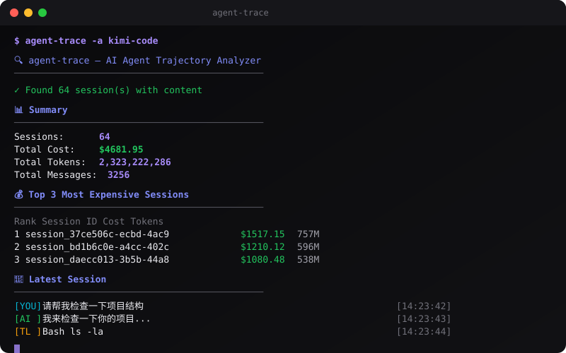

[English](README.md) | [中文](README.zh.md) | [日本語](README.ja.md) | [Français](README.fr.md) | [Español](README.es.md) | [العربية](README.ar.md) | [한국어](README.ko.md) | [Português](README.pt.md) | [Русский](README.ru.md) | [Deutsch](README.de.md)

<div align="center">


</div>

# 🔍 Agent Trace

<div align="center">

**ماذا يفعل مساعدك الذكي بالفعل؟ تتبّع التكاليف، والرموز، وصحة الأدوات، وكل محادثة.**

[](https://www.npmjs.com/package/agent-trace)
[](https://www.npmjs.com/package/agent-trace)
[](LICENSE)
[](https://github.com/liangzhengtao/agent-trace)

</div>

<div align="center">

</div>

---

## المشكلة

يعمل مساعد البرمجة الذكي لديك لساعات. يستدعي الأدوات، ويستهلك الرموز، ويعيد المحاولة عند فشل العمليات. لكنك لا تعرف:

- 💸 كم أنفق فعلياً
- 🔧 أي الأدوات تفشل باستمرار
- 🔄 لماذا أعاد المحاولة 15 مرة
- 🐌 هل كان النموذج بطيئاً أم كانت الأدوات معطلة
- ⏱️ كم من الوقت استغرقت كل محادثة

## الحل

```bash
npx agent-trace
```

**أمر واحد. لا حاجة لمفاتيح API. لا خدمات سحابية. كل شيء يعمل محلياً.**

---

## البدء السريع

```bash
# التثبيت
npm install -g agent-trace

# الكشف التلقائي وتحليل جميع الجلسات
agent-trace

# تحليل جلسات Kimi Code
agent-trace -a kimi-code

# تحليل جلسات Claude Code
agent-trace -a claude-code

# عرض أعلى 10 جلسات من حيث التكلفة
agent-trace -n 10

# الإخراج بصيغة JSON
agent-trace --json
```

## ما يعرضه

### عرض الملخص (عدة جلسات)

```
  📊 Summary
  ─────────────────────────────────────────────────────
  Sessions:      64
  Total Cost:    $4681.95
  Total Tokens:  2,323,222,286
  Total Messages: 3256
  Total Tools:   11570
  Total Time:    1593h 49m

  💰 Top 5 Most Expensive Sessions
  ─────────────────────────────────────────────────────
  Rank  Session ID                         Cost      Tokens    Messages
  ────  ─────────────────────────────────  ────────  ────────  ────────
     1  session_37ce506c-ecbd-4ac9-8151   $1517.15  757,285,306      1177
     2  session_bd1b6c0e-a4cc-402c-8c1e   $1210.12  596,458,795       508
     3  session_daecc013-3b5b-44a8-9c19   $1080.48  538,333,781       489
```

### تفاصيل الجلسة

```
  🔍 Agent Trace Report
  ─────────────────────────────────────────────────────

  📊 Session Overview
  ─────────────────────────────────────────────────────
  Duration: 45m 23s
  Messages: 127 (User: 32, AI: 64, Tool: 31)
  Tool Calls: 89 (12 unique tools)
  Errors: 3
  Retries: 2

  💰 Cost Analysis
  ─────────────────────────────────────────────────────
  Input Tokens:  245,891  ($0.0738)
  Output Tokens: 89,234  ($0.1339)
  Total Tokens:  335,125
  Estimated Cost: $0.2076

  🔧 Tool Health
  ─────────────────────────────────────────────────────
  ✓ Read            ████████████████████ 100%  (45 calls, avg 120ms)
  ✓ Write           ████████████████████ 100%  (23 calls, avg 85ms)
  ⚠ Bash            ███████████████░░░░░  75%  (12 calls, avg 2s)
  ✗ Browser         ████████░░░░░░░░░░░░  44%  (9 calls, avg 5s)

  ⚠️  Anomalies
  ─────────────────────────────────────────────────────
  → High tool failure rate: 18/89
  → High estimated cost: $5.23

  ⏱️  Active Periods
  ─────────────────────────────────────────────────────
  09:15:23 → 09:47:56 (32m 33s, 45 messages)
  10:02:11 → 10:31:44 (29m 33s, 52 messages)

  💬 Conversation
  ─────────────────────────────────────────────────────
  [YOU] Fix the authentication bug...                    10:31:12
  [AI ] I'll check the auth middleware...                10:31:14 (+2s)
  [YOU] What about the token validation?                 10:31:30 (+16s)
  [AI ] Fixed. The issue was...                          10:31:44 (+14s)
```

---

## الخيارات

```
agent-trace [options] [directory]

Options:
  -s, --session <id>   Analyze specific session
  -j, --json           Output as JSON
  -v, --verbose        Show detailed timeline
  -a, --agent <type>   Agent type (opencode, kimi-code, claude-code, codex)
  -n, --top <count>    Show top N sessions by cost (default: 5)
  --all                Show all sessions (including empty)
  --list-agents        List supported agents
  -h, --help           Display help
  -V, --version        Display version
```

## المساعدون المدعومون

| المساعد | الحالة | مسار الإعدادات |
|---------|--------|----------------|
| **OpenCode** | ✅ مدعوم | `~/.opencode/sessions/` |
| **Claude Code** | ✅ مدعوم | `~/.claude/projects/` |
| **Kimi Code** | ✅ مدعوم | `~/.kimi-code/sessions/` |
| **Codex** | ✅ مدعوم | `~/.codex/sessions/` |
| **Cursor** | 🔜 قريباً | — |
| **Windsurf** | 🔜 قريباً | — |
| **Cline** | 🔜 قريباً | — |
| **Continue** | 🔜 قريباً | — |

### الكشف التلقائي

بشكل افتراضي، يمسح agent-trace جميع المسارات المعروفة ويكتشف تلقائياً أي مساعد تستخدمه:

```bash
agent-trace  # الكشف التلقائي وتحليل جميع الجلسات
```

### إجبار مساعد محدد

```bash
agent-trace -a claude-code   # تحليل Claude Code فقط
agent-trace -a kimi-code     # تحليل Kimi Code فقط
agent-trace -a opencode      # تحليل OpenCode فقط
agent-trace -a codex         # تحليل Codex فقط
```

## التكامل مع CI

```yaml
# GitHub Actions - فحص تكاليف المساعد
- name: Check agent costs
  run: |
    npx agent-trace --json > trace.json
    COST=$(jq '.costBreakdown.total.cost' trace.json)
    if (( $(echo "$COST > 10" | bc -l) )); then
      echo "Agent cost too high: $COST"
      exit 1
    fi
```

---

## كيف يعمل

1. **قراءة ملفات الجلسات المحلية** — لا طلبات شبكة، لا استدعاءات API
2. **تحليل سجل الرسائل** — استخراج الأدوار والرموز والطوابع الزمنية
3. **تحليل استدعاءات الأدوات** — تتبع معدلات النجاح والفشل
4. **حساب التكاليف** — بناءً على أسعار API القياسية
5. **كشف الشذوذ** — المحاولات المتكررة، الفشل، التكاليف المرتفعة
6. **إنشاء التقرير** — إخراج في الطرفية أو بصيغة JSON

## الخصوصية

- ✅ محلي 100% — لا تغادر البيانات جهازك
- ✅ للقراءة فقط — لا يتم تعديل ملفات الجلسات أبداً
- ✅ لا حاجة لمفاتيح API — لا خدمات خارجية
- ✅ لا تتبع — لا تحليلات، لا إرسال بيانات

---

## المساهمة

انظر [CONTRIBUTING.md](CONTRIBUTING.md).

## الترخيص

[MIT](LICENSE)

---

## الإصدار الصيني

[README.zh.md](README.zh.md)
