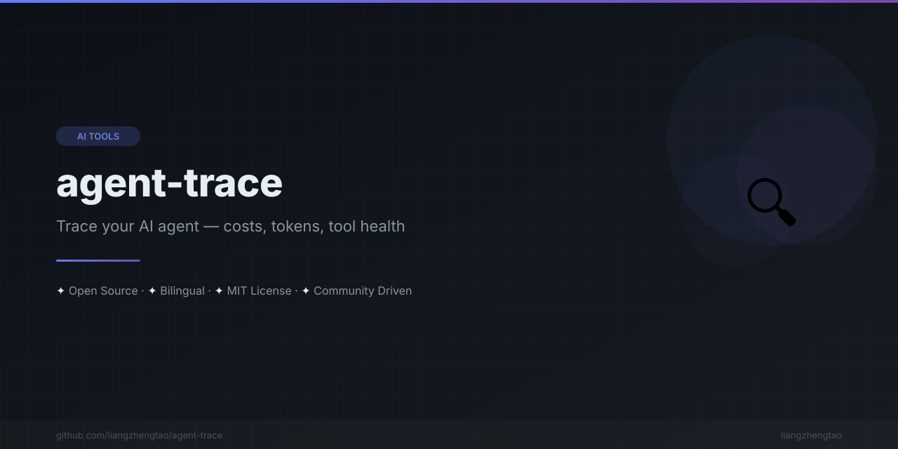

[English](README.md) | [中文](README.zh.md) | [日本語](README.ja.md) | [Français](README.fr.md) | [Español](README.es.md) | [العربية](README.ar.md) | [한국어](README.ko.md) | [Português](README.pt.md) | [Русский](README.ru.md) | [Deutsch](README.de.md)

<div align="center">



</div>

# 🔍 Agent Trace

<div align="center">

**AIエージェントは実際に何をしているのか？コスト、トークン、ツールの健全性、すべての会話を追跡。**

[](https://www.npmjs.com/package/agent-trace)
[](https://www.npmjs.com/package/agent-trace)
[](LICENSE)
[](https://github.com/Serennity007/agent-trace)

</div>

<div align="center">

</div>

---

## 課題

AIコーディングエージェントは何時間も稼働し続けます。ツールを呼び、トークンを消費し、失敗した操作をリトライします。しかし、以下のことがわかりません：

- 💸 実際にいくらかかったか
- 🔧 どのツールが繰り返し失敗しているか
- 🔄 なぜ15回もリトライしたのか
- 🐌 モデルが遅いのか、ツールが壊れていたのか
- ⏱️ それぞれの会話にどのくらい時間がかかったか

## 解決策

```bash
npx agent-trace
```

**コマンド一つ。APIキー不要。クラウドサービス不要。すべてローカルで実行。**

---

## クイックスタート

```bash
# インストール
npm install -g agent-trace

# すべてのセッションを自動検出して分析
agent-trace

# Kimi Code のセッションを分析
agent-trace -a kimi-code

# Claude Code のセッションを分析
agent-trace -a claude-code

# コスト上位10セッションを表示
agent-trace -n 10

# JSON で出力
agent-trace --json
```

## 表示内容

### サマリービュー（複数セッション）

```
  📊 Summary
  ─────────────────────────────────────────────────────
  Sessions:      64
  Total Cost:    $4681.95
  Total Tokens:  2,323,222,286
  Total Messages: 3256
  Total Tools:   11570
  Total Time:    1593h 49m

  💰 Top 5 Most Expensive Sessions
  ─────────────────────────────────────────────────────
  Rank  Session ID                         Cost      Tokens    Messages
  ────  ─────────────────────────────────  ────────  ────────  ────────
     1  session_37ce506c-ecbd-4ac9-8151   $1517.15  757,285,306      1177
     2  session_bd1b6c0e-a4cc-402c-8c1e   $1210.12  596,458,795       508
     3  session_daecc013-3b5b-44a8-9c19   $1080.48  538,333,781       489
```

### セッション詳細

```
  🔍 Agent Trace Report
  ─────────────────────────────────────────────────────

  📊 Session Overview
  ─────────────────────────────────────────────────────
  Duration: 45m 23s
  Messages: 127 (User: 32, AI: 64, Tool: 31)
  Tool Calls: 89 (12 unique tools)
  Errors: 3
  Retries: 2

  💰 Cost Analysis
  ─────────────────────────────────────────────────────
  Input Tokens:  245,891  ($0.0738)
  Output Tokens: 89,234  ($0.1339)
  Total Tokens:  335,125
  Estimated Cost: $0.2076

  🔧 Tool Health
  ─────────────────────────────────────────────────────
  ✓ Read            ████████████████████ 100%  (45 calls, avg 120ms)
  ✓ Write           ████████████████████ 100%  (23 calls, avg 85ms)
  ⚠ Bash            ███████████████░░░░░  75%  (12 calls, avg 2s)
  ✗ Browser         ████████░░░░░░░░░░░░  44%  (9 calls, avg 5s)

  ⚠️  Anomalies
  ─────────────────────────────────────────────────────
  → High tool failure rate: 18/89
  → High estimated cost: $5.23

  ⏱️  Active Periods
  ─────────────────────────────────────────────────────
  09:15:23 → 09:47:56 (32m 33s, 45 messages)
  10:02:11 → 10:31:44 (29m 33s, 52 messages)

  💬 Conversation
  ─────────────────────────────────────────────────────
  [YOU] Fix the authentication bug...                    10:31:12
  [AI ] I'll check the auth middleware...                10:31:14 (+2s)
  [YOU] What about the token validation?                 10:31:30 (+16s)
  [AI ] Fixed. The issue was...                          10:31:44 (+14s)
```

---

## オプション

```
agent-trace [options] [directory]

Options:
  -s, --session <id>   特定のセッションを分析
  -j, --json           JSON で出力
  -v, --verbose        詳細なタイムラインを表示
  -a, --agent <type>   エージェントタイプ (opencode, kimi-code, claude-code, codex)
  -n, --top <count>    コスト上位 N セッションを表示 (デフォルト: 5)
  --all                すべてのセッションを表示（空のセッションも含む）
  --list-agents        サポートされているエージェントを一覧表示
  -h, --help           ヘルプを表示
  -V, --version        バージョンを表示
```

## 対応エージェント

| エージェント | ステータス | 設定パス |
|-------------|-----------|---------|
| **OpenCode** | ✅ 対応済み | `~/.opencode/sessions/` |
| **Claude Code** | ✅ 対応済み | `~/.claude/projects/` |
| **Kimi Code** | ✅ 対応済み | `~/.kimi-code/sessions/` |
| **Codex** | ✅ 対応済み | `~/.codex/sessions/` |
| **Cursor** | 🔜 対応予定 | — |
| **Windsurf** | 🔜 対応予定 | — |
| **Cline** | 🔜 対応予定 | — |
| **Continue** | 🔜 対応予定 | — |

### 自動検出

デフォルトでは、agent-trace はすべての既知のパスをスキャンし、使用中のエージェントを自動検出します：

```bash
agent-trace  # 自動検出してすべてのセッションを分析
```

### 特定のエージェントを指定

```bash
agent-trace -a claude-code   # Claude Code のみ分析
agent-trace -a kimi-code     # Kimi Code のみ分析
agent-trace -a opencode      # OpenCode のみ分析
agent-trace -a codex         # Codex のみ分析
```

## CI 統合

```yaml
# GitHub Actions - エージェントコストの確認
- name: Check agent costs
  run: |
    npx agent-trace --json > trace.json
    COST=$(jq '.costBreakdown.total.cost' trace.json)
    if (( $(echo "$COST > 10" | bc -l) )); then
      echo "エージェントコストが高すぎます: $COST"
      exit 1
    fi
```

---

## 仕組み

1. **ローカルセッションファイルを読み取り** — ネットワークリクエストなし、API呼び出しなし
2. **メッセージ履歴を解析** — ロール、トークン、タイムスタンプを抽出
3. **ツール呼び出しを分析** — 成功/失敗率を追跡
4. **コストを算出** — 標準 API 料金に基づく
5. **異常を検出** — 高リトライ、高失敗率、高コスト
6. **レポートを生成** — ターミナル出力または JSON

## プライバシー

- ✅ 100% ローカル — データは外部に送信されません
- ✅ 読み取り専用 — セッションファイルを変更しません
- ✅ API キー不要 — 外部サービスに依存しません
- ✅ トラッキングなし — 分析データやテレメトリもありません

---

## コントリビューション

[CONTRIBUTING.md](CONTRIBUTING.md) をご覧ください。

## ライセンス

[MIT](LICENSE)

---

## 中文版本

[README.zh.md](README.zh.md)
